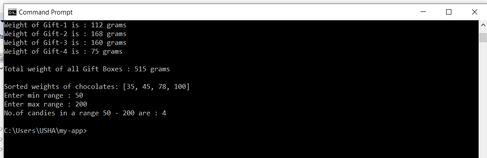

# UshasriMavuri_Maven_OOP
# Week-2
## MAVEN & OOP
### Task-1

   Maven is a build automation tool used primarily for Java projects. Maven can also be used to build and manage projects written in C#, Ruby, Scala, and other languages. The Maven project is hosted by the Apache Software Foundation, where it was formerly part of the Jakarta Project.
   - Download using the link
  ```sh
   https://www-eu.apache.org/dist/maven/maven-3/3.6.3/binaries/apache-maven-3.6.3-bin.tar.gz
  ```
- Installing Apache Maven
    - Ensure JAVA_HOME environment variable is set and points to your JDK installation
    - Extract distribution archive in any directory
```sh
  unzip apache-maven-3.6.3-bin.zip
  ```
- Alternatively use your preferred archive extraction tool.
    - Add the bin directory of the created directory apache-maven-3.6.3 to the PATH environment variable
    - Confirm with mvn -v in a new shell. The result should look similar to
```sh
Apache Maven 3.6.3 (cecedd343002696d0abb50b32b541b8a6ba2883f)
Maven home: /opt/apache-maven-3.6.3
Java version: 1.8.0_45, vendor: Oracle Corporation
Java home: /Library/Java/JavaVirtualMachines/jdk1.8.0_45.jdk/Contents/Home/jre
Default locale: en_US, platform encoding: UTF-8
OS name: "mac os x", version: "10.8.5", arch: "x86_64", family: "mac"
```

### Creating a Maven Project
```sh
mvn archetype:generate -DgroupId=com.mycompany.app -DartifactId=my-app -DarchetypeArtifactId=maven-archetype-quickstart -DarchetypeVersion=1.4 -DinteractiveMode=false
```
### Build the Project
```sh
mvn package
```
- You may test the newly compiled and packaged JAR with the following command:
```sh
java -cp target/my-app-1.0-SNAPSHOT.jar com.mycompany.app.App
```

### Task-2
Design an object model for a given domain. Use (demonstrate the ability to work with):
> Classes (abstract classes – if possible)
> Interfaces
> Inheritance
> Polymorphism
> Encapsulation
##### Create the below project using Maven.
- New Year's gift. Identify the hierarchy of chocolates and other sweets. Create multiple objects of sweets. Collect children's gift to define total weight. Sort the chocolates in a gift by one of the options. Find candies in the gift corresponding to a predetermined range of options.
 
    - Classes that I've used are **Chocolates** , **Sweets**, **GiftBox** and **Main**
    - Methods that I've used are ***sendChocoWeights***, ***sendSweetWeights***, ***totalweights***, ***sortChocoWeights***.
    - I've Instantiated **Chocolates** and **Sweets** class.
    - I've stored the weights, names of chocolates and sweets in an **Array List**
    - I've sorted chocloates based on their weights
    - Later Calculated each Gift-Box weight
    - Finally I've found the candies in each box by means of their weights based on some predetermined ranges.
    - Within this project I've achieved **Classes**, **Inheritance**, **Polymorphism**, **Encapsulation** concepts in Object Oriented Programming.
- After compiled using below commands:
```sh
mvn package
mvn test
java -cp target/my-app-1.0-SNAPSHOT.jar com.mycompany.app.App
```
- I've obtained the result as:

